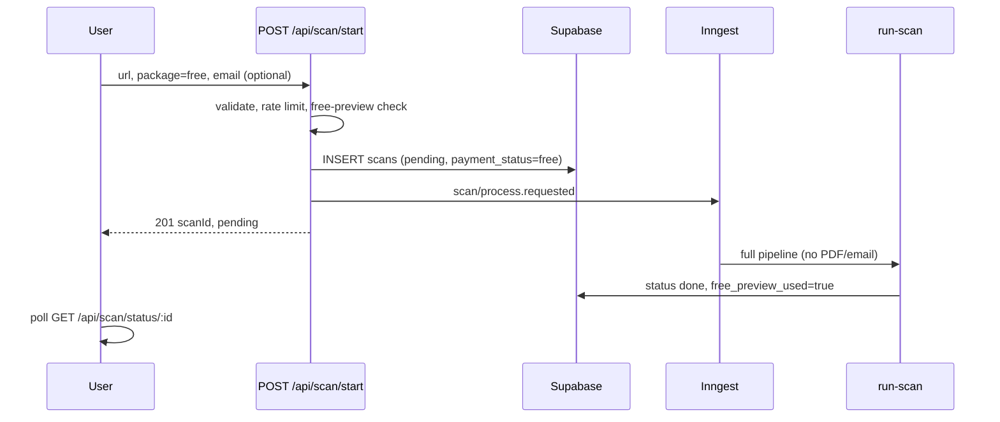
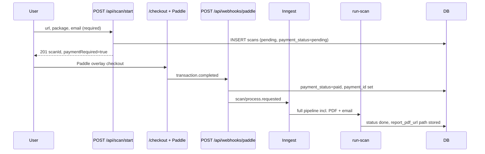

# QAlaunch — Implemented Process Report

**Generated:** May 18, 2026  
**Purpose:** Full documentation of every process currently implemented in the codebase. This is a read-only report; it does not change application behavior.

**Related docs (partial overlap):** `docs/API.md`, `web/ARCHITECTURE.md`, `docs/architecture-review.md`

---

## Table of contents

1. [Product summary](#1-product-summary)
2. [Repository layout](#2-repository-layout)
3. [Technology stack](#3-technology-stack)
4. [End-to-end journeys](#4-end-to-end-journeys)
5. [Scan start API (`POST /api/scan/start`)](#5-scan-start-api-post-apiscanstart)
6. [Rate limiting and abuse controls](#6-rate-limiting-and-abuse-controls)
7. [Payment flow (Paddle)](#7-payment-flow-paddle)
8. [Background orchestration (Inngest)](#8-background-orchestration-inngest)
9. [Inngest pipeline: step-by-step](#9-inngest-pipeline-step-by-step)
10. [Website type detection](#10-website-type-detection)
11. [Page selection and roles](#11-page-selection-and-roles)
12. [PageSpeed Insights collection](#12-pagespeed-insights-collection)
13. [Browser scanning (Browserbase + Playwright)](#13-browser-scanning-browserbase--playwright)
14. [Screenshot storage and compression](#14-screenshot-storage-and-compression)
15. [AI analysis (Claude)](#15-ai-analysis-claude)
16. [Issue persistence and free preview](#16-issue-persistence-and-free-preview)
17. [PDF report generation and email](#17-pdf-report-generation-and-email)
18. [Scan status API](#18-scan-status-api)
19. [Health scoring](#19-health-scoring)
20. [Failure handling](#20-failure-handling)
21. [Database model and status machine](#21-database-model-and-status-machine)
22. [Frontend surfaces](#22-frontend-surfaces)
23. [Environment variables reference](#23-environment-variables-reference)
24. [Local development workflow](#24-local-development-workflow)
25. [Production deployment notes](#25-production-deployment-notes)

---

## 1. Product summary

QAlaunch is an automated website QA product. A user submits a public URL and a package tier. The system:

1. Creates a scan record in Supabase.
2. For **paid** tiers, waits for Paddle payment before starting work.
3. For **free** tier, starts immediately (one preview per website URL hash).
4. Runs a durable **Inngest** pipeline that detects site type, selects pages, collects Google PageSpeed data, runs headless browser checks via **Browserbase**, analyzes findings with **Claude**, and (for paid tiers) generates a **PDF** and emails a signed download link via **Resend**.
5. Exposes results through `GET /api/scan/status/[scanId]` and the `/result` UI.

There is **no separate VPS scanner service**. All browser work runs inside Inngest steps on the Next.js deployment (`web/lib/scan/`).

---

## 2. Repository layout

```
qalaunch/
├── docs/                    # Documentation (this file, API.md, etc.)
├── README.md                # Top-level setup overview
└── web/                     # Next.js application (Vercel root)
    ├── app/                 # Routes, API handlers, pages
    ├── components/          # Marketing, checkout, audit UI
    ├── lib/
    │   ├── api/             # PageSpeed, Paddle, queue-scan-job, rate limits
    │   ├── checkout/        # Paddle client helpers
    │   ├── db/              # Supabase client + retries
    │   ├── inngest/         # Client, events, run-scan, handle-scan-failed
    │   ├── report/          # HTML render, PDF storage, email
    │   ├── scan/            # Runner, services, steps, AI, browser
    │   ├── scoring/         # Health score / grade
    │   └── utils/           # URL, detect, page-selection, PageSpeed saver
    └── types/zod.ts         # Shared schemas (packages, statuses)
```

---

## 3. Technology stack


| Layer               | Technology                                                   |
| ------------------- | ------------------------------------------------------------ |
| Web app             | Next.js (App Router), React, Tailwind                        |
| Database & storage  | Supabase (Postgres + Storage buckets)                        |
| Background jobs     | Inngest (`scan/process.requested` → `run-scan`)              |
| Browser automation  | Browserbase + `playwright-core` + `@axe-core/playwright`     |
| AI                  | Anthropic Claude (`claude-sonnet-4-6` default) with tool use |
| Performance metrics | Google PageSpeed Insights API v5                             |
| Payments            | Paddle Billing (checkout + webhooks)                         |
| Email               | Resend                                                       |
| Validation          | Zod (`types/zod.ts`)                                         |


---

## 4. End-to-end journeys

### 4.1 Free scan journey




**Rules specific to free:**

- One free preview per **website** (`url_hash` + `free_preview_used`).
- Duplicate attempts return **409** with code `free_preview_used`.
- Email is optional but validated if provided.
- Pipeline skips `generate-pdf` and `send-email`.
- Only **3 issues** are flagged `is_in_free_preview` for the results UI; the rest are locked.

### 4.2 Paid scan journey




**Rules specific to paid:**

- Scan row is created **before** payment; work does **not** start until webhook fires.
- `POST /api/scan/start` returns `paymentRequired: true` and does **not** queue Inngest.
- Webhook validates package matches DB, idempotency on `payment_id`, then calls `queueScanJob`.

### 4.3 Enterprise

- Pricing UI links to `/contact` (no self-serve Paddle checkout in code).

---

## 5. Scan start API (`POST /api/scan/start`)

**File:** `web/app/api/scan/start/route.ts`  
**Runtime:** `nodejs`

### 5.1 Request body (Zod: `scanStartSchema`)


| Field     | Type            | Rules                                                                     |
| --------- | --------------- | ------------------------------------------------------------------------- |
| `url`     | string          | Required, min length 1                                                    |
| `package` | enum            | `free`, `basic`, `standard`, `premium`, `enterprise`                      |
| `email`   | string optional | **Paid:** required, valid email. **Free:** optional; validated if present |


### 5.2 Processing order

1. **Parse JSON** with `scanStartSchema.safeParse` → 400 `invalid_request` on failure.
2. **Normalize URL** via `normalizeUrl()` (`lib/utils/url.ts`).
3. **Block private URLs** via `isPrivateUrl()` → 400 `private_url_not_allowed` (localhost, private IPs, etc.).
4. **Rate limits** — `assertScanStartAllowed()` (see [§6](#6-rate-limiting-and-abuse-controls)).
5. **Free preview guard** — if `package === 'free'`, query `scans` for same `url_hash` with `free_preview_used = true` → 409.
6. **Insert scan row** with:
  - `url`, `url_hash`, `package`, `status: 'pending'`
  - `user_email` (nullable)
  - `payment_status`: `'free'` for free, `'pending'` for paid
  - `free_preview_used: false`
7. **Handle unique constraint** on free duplicate insert → 409 (race-safe).
8. **Branch:**
  - **Paid:** return 201 with `paymentRequired: true`, `targetUrl`, **no** Inngest enqueue.
  - **Free:** `queueScanJob()` then 201 with success message.

### 5.3 Success responses

**Free (201):**

```json
{
  "ok": true,
  "scanId": "<uuid>",
  "status": "pending",
  "message": "Scan started successfully."
}
```

**Paid (201):**

```json
{
  "ok": true,
  "scanId": "<uuid>",
  "status": "pending",
  "paymentRequired": true,
  "targetUrl": "https://example.com/",
  "message": "Complete payment to start your audit."
}
```

### 5.4 Queue payload (`queueScanJob`)

**File:** `web/lib/api/queue-scan-job.ts`

Sends Inngest event `scan/process.requested` with:

```ts
{
  scanId: string;
  targetUrl: string;
  package: ScanPackage;
  userEmail: string | null;
}
```

Uses `INNGEST_EVENT_KEY` in production for `inngest.send()`.

---

## 6. Rate limiting and abuse controls

**File:** `web/lib/api/scan-start-rate-limit.ts`

Rolling **1-hour** window. Configurable via env (defaults in parentheses):


| Limit                           | Env variable                             | Default |
| ------------------------------- | ---------------------------------------- | ------- |
| Per IP (in-memory per instance) | `SCAN_START_RATE_LIMIT_PER_IP_HOUR`      | 10      |
| Per email (DB count)            | `SCAN_START_RATE_LIMIT_PER_EMAIL_HOUR`   | 5       |
| Global free scans (DB count)    | `SCAN_START_RATE_LIMIT_FREE_GLOBAL_HOUR` | 50      |


- IP from `x-forwarded-for` (first hop) or `x-real-ip`.
- Exceeded → **429** `rate_limit_exceeded` with user-facing message.
- In-memory IP bucket resets per instance (serverless caveat documented in code comments).

---

## 7. Payment flow (Paddle)

### 7.1 Checkout UI

**Files:** `web/components/checkout/checkout-experience.tsx`, `web/lib/checkout/paddle-client.ts`, `web/components/pricing/pricing-plans.ts`

- Route: `/checkout?package=basic|standard|premium&url=...`
- Self-serve packages: **basic**, **standard**, **premium** only.
- Validates public URL + email client-side before calling scan start.
- Flow: `POST /api/scan/start` → receive `scanId` → open Paddle checkout with **custom data**: `scanId`, `package`, `targetUrl`, `userEmail`.
- Price IDs from `NEXT_PUBLIC_PADDLE_*_PRICE_ID` env vars.

### 7.2 Webhook

**File:** `web/app/api/webhooks/paddle/route.ts`


| Step                 | Behavior                                                                           |
| -------------------- | ---------------------------------------------------------------------------------- |
| Verify signature     | `verifyAndParsePaddleWebhook` — invalid → **401**                                  |
| Event filter         | Only `transaction.completed` processed; others → `{ ok: true, ignored: true }`     |
| Validate transaction | Must be `status === 'completed'`                                                   |
| Custom data          | Requires `scanId`, `targetUrl`, valid paid `package` (not `free`)                  |
| Load scan            | 404 if missing                                                                     |
| Idempotency          | Same `payment_id` → `{ ok: true, duplicate: true }`                                |
| Conflict guard       | Different `payment_id` when already paid → **409**                                 |
| Package tampering    | Webhook package must match `scans.package` → **409**                               |
| Update scan          | `payment_id`, `payment_status: 'paid'`, `status: 'pending'`, clear `error_message` |
| Queue job            | `queueScanJob()` — failure → **500** `queue_failed`                                |


---

## 8. Background orchestration (Inngest)

### 8.1 Serve endpoint

**File:** `web/app/api/inngest/route.ts`

- Registers functions: `runScan`, `handleScanFailed`
- `maxDuration = 300` seconds per step (Vercel)
- Production serve URL: `{NEXT_PUBLIC_APP_URL}/api/inngest`

### 8.2 Registered functions


| ID                   | Trigger                              | Retries | Concurrency                                |
| -------------------- | ------------------------------------ | ------- | ------------------------------------------ |
| `run-scan`           | `scan/process.requested`             | 2       | `INNGEST_SCAN_CONCURRENCY` (default **5**) |
| `handle-scan-failed` | `inngest/function.failed` (internal) | —       | —                                          |


### 8.3 Failure sidecar

**File:** `web/lib/inngest/functions/handle-scan-failed.ts`

When any `run-scan` execution exhausts retries:

1. Listens to Inngest internal `FunctionFailed` event.
2. Filters `function_id` containing `run-scan`.
3. Reads `scanId` from original event data.
4. Calls `failScan()` → user-facing `error_message`, `status: 'failed'`, `completed_at`.

---

## 9. Inngest pipeline: step-by-step

**Orchestrator:** `web/lib/inngest/functions/run-scan.ts`  
**Step implementations:** `web/lib/scan/steps/*.ts`

Each `step.run('name', fn)` is a **durable** Inngest step (retriable, replay-safe).


| #   | Step name                 | Function                   | What it does                                                                        |
| --- | ------------------------- | -------------------------- | ----------------------------------------------------------------------------------- |
| 1   | `mark-crawling`           | `markCrawlingStep`         | Sets `scans.status = 'crawling'`                                                    |
| 2   | `detect-and-select-pages` | `detectAndSelectPagesStep` | Fetch homepage HTML, detect type, select URLs + roles                               |
| 3   | `persist-metadata`        | `persistScanMetadataStep`  | Save `website_type`, `pages_to_test`, upsert `scan_pages` rows                      |
| 4   | `prepare-scanner`         | `prepareScannerStep`       | `prepareScannerScan()` → `status = 'analyzing'`                                     |
| 5   | `collect-pagespeed`       | `collectPageSpeedStep`     | PSI mobile + desktop per page → `page_speed_data`                                   |
| 6   | `scan-page:{slug}`        | `scanPageStep`             | **Parallel** per URL — Playwright scan + persist (one Browserbase session per page) |
| 7   | `finalize-scanner`        | `finalizeScannerStep`      | If all pages failed → `failed`; else stay `analyzing`                               |
| 8   | `reload-scan`             | `reloadScanStep`           | Fresh scan row; early exit if already `failed`                                      |
| 9   | `clear-ai-issues`         | `clearAiAnalysisStep`      | Delete `issues` for scan; null `scan_pages.ai_analysis`                             |
| 10  | `ai-page:{slug}`          | `analyzePageStep`          | **Parallel** Claude per page → `ai_analysis` JSON on row                            |
| 11  | `persist-ai-issues`       | `persistAiIssuesStep`      | Merge AI issues into `issues` table; free preview flags                             |
| 12  | `generate-pdf`            | `generatePdfStep`          | **Paid only** — HTML → PDF → storage                                                |
| 13  | `send-email`              | `sendReportEmailStep`      | **Paid only** — signed URL + Resend                                                 |
| 14  | `mark-done`               | `markScanDoneStep`         | `status = 'done'`, `completed_at`; free sets `free_preview_used = true`             |


**Early exits:**

- After step 7: if `scannerStatus === 'failed'`, pipeline stops (no AI/PDF).
- After step 8: if `scanAfter.status === 'failed'`, pipeline stops.

**Step ID slugs:** `stepIdFromPageUrl(pageUrl)` sanitizes URL for Inngest step names (`web/lib/inngest/step-id.ts`).

---

## 10. Website type detection

**Files:** `web/lib/utils/detect.ts`, called from `detectAndSelectPagesStep`

### 10.1 Input

- Homepage HTML (fetched in `fetchHomepageHtml` — `web/lib/api/fetchHomePageHtml.ts`)
- Base URL string

### 10.2 Normalization (Cheerio)

Extracts lowercase: full HTML, `nav`+`header` text, `body` text, `title`.

### 10.3 Type priority (first match wins)


| Order | Type        | Key signals                                                                   |
| ----- | ----------- | ----------------------------------------------------------------------------- |
| 1     | `ecommerce` | Cart/checkout links, buy buttons, Shopify/WooCommerce, product meta, shop nav |
| 2     | `saas`      | Pricing/features/login nav, trial/subscription text, `app.` hostname          |
| 3     | `business`  | Services/about/contact nav, quote/demo text, any form                         |
| 4     | `blog`      | `<article>`, RSS, recent posts, Article schema, `/blog/` in HTML              |
| 5     | `portfolio` | Portfolio/work/projects nav, case studies text                                |
| 6     | `landing`   | Small nav + many hash links, repeated CTAs                                    |
| 7     | `unknown`   | No match                                                                      |


Saved to `scans.website_type`.

### 10.4 Auth detection (informational)

`requiresAuth` is computed via six layers (subdomains, paths, password fields, auth links/forms, text, meta, gated signals).

When true, attaches (currently for logging/UI potential, **not** stored in DB by default):

- `notes`: authenticated areas not scanned
- `banner`: Custom plan CTA text
- `contactUrl`: `mailto:hello@getqalaunch.com?subject=...`

**Scan still runs** on public pages only; auth paths filtered in page selection.

---

## 11. Page selection and roles

**Files:** `web/lib/utils/page-selection.ts`, `persistScanMetadataStep`

### 11.1 Link harvesting

- Parses all `<a href>` on homepage.
- Keeps **same-origin** links only.
- Excludes: hash-only, `AUTH_PATH_PATTERN`, auth keywords in path, non-public pages.
- Normalizes trailing slashes and dedupes.
- Prefers nav/header link text when duplicate URLs.

### 11.2 Page roles

`inferPageRole()` assigns: `homepage`, `pricing`, `features`, `product`, `cart`, `checkout`, `about`, `contact`, `docs`, `blog`, `legal`, `other`.

### 11.3 Package page limits


| Package      | Max pages |
| ------------ | --------- |
| `free`       | 1         |
| `basic`      | 1         |
| `standard`   | 5         |
| `premium`    | 10        |
| `enterprise` | 15        |


Homepage is **always** included when limit ≥ 1.

### 11.4 Ranking

- `ROLE_PRIORITY` per website type orders which roles to pick first.
- Candidates scored: role weight, nav bonus (+12), ecommerce/SaaS-specific boosts/penalties, depth penalty.
- `resolveSelectionType()` can flip ecommerce ↔ saas if link graph contradicts homepage detection.
- Premium keeps `legal` and `other` in role order; lower tiers filter those out before fill.
- `fillWithBestPages()` fills remaining slots by score.

### 11.5 Persistence

- `scans.pages_to_test`: string[] of URLs
- `scan_pages` upsert on `(scan_id, page_url)` with `page_role`

### 11.6 Empty selection

`detectAndSelectPagesStep` throws `NonRetriableError` if no pages → pipeline fails without retry spam.

---

## 12. PageSpeed Insights collection

**Files:** `web/lib/api/pagespeed.ts`, `web/lib/utils/savePageSpeedForPage.ts`, `collectPageSpeedStep`

### 12.1 Per-page API calls

For each URL in `pagesToTest`:

- Strategies: **mobile** and **desktop** (sequential in `runPageSpeedForUrl`).
- Categories: performance, SEO, accessibility, best-practices.
- Optional `GOOGLE_PAGESPEED_API_KEY` query param.
- Timeout default **90s**; **1** retry on 429/5xx/abort.

### 12.2 Stored shape (`scan_pages.page_speed_data`)

Includes per strategy:

- Scores: `performance`, `seo`, `accessibility`, `bestPractices` (0–100)
- Metrics: `lcpMs`, `fcpMs`, `cls`, `ttiMs`
- Strategy-level error if call failed

If one strategy fails and the other succeeds, successful data is kept.

### 12.3 Concurrency

`PAGESPEED_CONCURRENCY = 1` (serial across pages in `collectPageSpeedForPages`).

DB updates retried up to **3** attempts with backoff.

---

## 13. Browser scanning (Browserbase + Playwright)

**Entry:** `scanPageStep` → `scanAndPersistPage()` in `web/lib/scan/runner.ts`  
**Core scan:** `runPlaywrightScanForUrl()` in `web/lib/scan/services/index.ts`

### 13.1 Session model

- **One Browserbase session per page** (fits serverless step timeouts).
- `createBrowserbaseSession(scanId, pageUrl)` with metadata `scanId`, `pageHost` (sanitized).
- Rate-limit retries on session create (up to 5, exponential backoff).
- `chromium.connectOverCDP(connectUrl)` then **new browser context per page** (isolated cookies/state).
- Session timeout: `BROWSERBASE_SESSION_TIMEOUT_SEC` (default 3600s, max 6h).

### 13.2 Page scan timeout

`SCAN_PAGE_TIMEOUT_MS` default **240000** (4 min), minimum 60000.

### 13.3 Collection sequence (per page)

After `navigatePage`:


| Step name            | Collector                                       | Notes                                   |
| -------------------- | ----------------------------------------------- | --------------------------------------- |
| `raw_html`           | `page.content()`                                | Truncated to `RAW_HTML_MAX_BYTES` UTF-8 |
| `broken_states`      | `collectBrokenStates`                           | Stuck loaders, bad tokens, empty lists  |
| `links`              | `collectLinks`                                  | Internal/external, broken link checks   |
| `interactive`        | `collectInteractiveData`                        | Buttons, forms                          |
| `seo`                | `collectSeoData`                                | Title, meta, headings, etc.             |
| `axe`                | `collectAxeViolations`                          | WCAG 2a/2aa/21aa tags                   |
| `axe_retry`          | Same page retry if axe failed but navigation OK |                                         |
| `screenshot:desktop` | `captureDesktopScreenshot`                      | Full page PNG                           |
| `responsive`         | `collectResponsive`                             | iPhone 14 emulation                     |
| `screenshot:mobile`  | From responsive viewport buffer                 |                                         |


**Parallel collectors** after navigation: broken_states, links, interactive, seo, axe (each with `withRetry`, 2 attempts).

**Diagnostics attached:** `attachPageDiagnostics` — console messages, failed requests, HTTP errors, response security headers.

### 13.4 Success criteria (`result.ok`)

- Navigation step succeeded **and**
- Either axe succeeded with violations array **or** both desktop and mobile screenshots captured.

If navigation OK but axe failed: warning added, may still succeed if screenshots exist.

### 13.5 Axe configuration

**File:** `web/lib/scan/services/accessibility.ts`  
Tags: `wcag2a`, `wcag2aa`, `wcag21aa`.

### 13.6 Responsive capture

**File:** `web/lib/scan/services/responsive.ts`

- Viewport: **iPhone 14** (390×844) with Playwright `devices['iPhone 14']`.
- Detects `hasHorizontalScroll`.
- Fallback navigation: `commit` wait if `safeGoto` fails on mobile.
- Animations **not** disabled (for lazy-load / IntersectionObserver).

### 13.7 `playwright_data` payload (version 3)

Stored on `scan_pages.playwright_data`:

- `links`, `interactive`, `consoleMessages`, `failedRequests`, `httpErrors`
- `seoData`, `brokenStates`, `programmaticRollup`, `responseSecurity`
- `steps[]` (per-step ok/error), `warnings[]`, `scanOk` boolean

Built in `buildPlaywrightPayload()` in `runner.ts`.

### 13.8 Finalize scanner

`finalizeScannerFromDb`:

- Reads all pages' `playwright_data.scanOk`.
- **Any** successful page → parent stays `analyzing`.
- **All** failed → `scans.status = 'failed'`, `error_message`, `completed_at`.

---

## 14. Screenshot storage and compression

**Bucket:** `SUPABASE_SCREENSHOT_BUCKET` (default `scan-screenshots`)

### 14.1 Upload path pattern

```
{scanId}/{sanitized-page-url}-{label}.{png|jpg}
```

Labels: `desktop`, `responsive-{n}-{viewport}-s{slice}`, etc.

### 14.2 Compression

`compressScreenshotBuffer()` — desktop vs responsive profiles; falls back to raw PNG on failure.

### 14.3 Retries

3 upload attempts with linear backoff (1s × attempt).

### 14.4 DB columns on `scan_pages`

- `screenshot_desktop_url`
- `screenshot_mobile_url`
- `screenshot_mobile_slice_urls` (array)
- `screenshot_responsive_slices` (viewport metadata + slice URLs)

Mobile URL derived from iPhone 14 responsive payload when available.

---

## 15. AI analysis (Claude)

**Per-page step:** `analyzePageStep` → `analyzeScanPageWithClaude()`  
**Aggregate:** `persistAiIssuesStep` → `persistScanIssuesFromAnalysis()`

**Main file:** `web/lib/scan/ai/runAiAnalysisForScan.ts`, `web/lib/scan/ai/claude.ts`

### 15.1 Preconditions

Skips page if desktop or mobile screenshot URL missing (logs warning).

### 15.2 Signed URLs for vision

Public storage URLs converted to **signed URLs** for Claude (`SCREENSHOT_SIGNED_URL_TTL_SEC`, default 3600s, clamped 60–86400).

### 15.3 Prompt structure

1. **Cached block** (`CLAUDE_SCAN_CACHEABLE_USER_TEXT`) — stable instructions, screenshot reading order.
2. **Dynamic before images** — page URL, role, website-type focus strings (ecommerce/SaaS/landing heuristics).
3. **Images** — desktop then mobile (signed URLs).
4. **Dynamic after images** — PageSpeed JSON, console, broken links, forms, SEO, security headers, axe violations, broken states, programmatic rollup, responsive data, network failures.

### 15.4 Claude API

- Model: `ANTHROPIC_MODEL` or `claude-sonnet-4-6`
- **Tool use:** `report_scan_issues` — structured JSON schema for issues
- System prompt: senior QA persona, categories, severity, field length bounds, evidence types, optional bounding boxes
- Retries on 429/5xx (default 2)
- Timeout default 90s

### 15.5 Issue categories (AI)

`functionality`, `ui_bugs`, `usability_ux`, `responsiveness`, `performance`, `seo`, `accessibility`, `security`, `content`

Severities: `critical`, `high`, `medium`, `low`

### 15.6 Per-page result storage

Success → `scan_pages.ai_analysis = { issues: ClaudeIssue[] }`  
Failure → `{ status: 'failed', analyzed_at, error }` then step throws (Inngest may retry).

### 15.7 Parallelism

One Inngest step per page (`ai-page:{slug}`) — parallel across pages.

---

## 16. Issue persistence and free preview

**File:** `persistScanIssuesFromAnalysis()` in `runAiAnalysisForScan.ts`

### 16.1 Merge logic

1. Load all `scan_pages` with `ai_analysis`.
2. Order pages by `pages_to_test` sequence.
3. Flatten issues into `issues` table rows with `scan_page_id`, category, severity, title, description, impact, `page_section`, `fix_instructions`, `screenshot_url` (desktop), `display_order`.
4. Sort by severity rank (critical → low), then `scan_page_id`.
5. Insert in chunks of **50**.

### 16.2 Partial failure policy

- If **all** attempted pages failed AI → throw (pipeline fails).
- If **some** failed → warn in logs, continue with successful pages.

### 16.3 Free preview selection

When `package === 'free'`:

- `FREE_PREVIEW_ISSUE_COUNT = 3`
- `selectBalancedPreview()` tries to pick:
  1. One critical **functionality** issue
  2. One high/critical **usability_ux**
  3. One high/critical **responsiveness**
- Then fills remaining slots from sorted list.
- Sets `is_in_free_preview = true` on chosen rows only.

---

## 17. PDF report generation and email

**Paid packages only** (steps 12–13 in pipeline).

### 17.1 Generate PDF

**Files:** `web/lib/scan/steps/generatePdf.ts`, `web/lib/report/generateAndStorePdfReport.ts`, `web/lib/report/renderReportHtml.tsx`, `web/lib/scan/pdf.ts`

1. Load `scans`, `scan_pages`, `issues` (ordered).
2. `renderReportHtml()` — React/server HTML template.
3. `generatePdfFromHtml()` — Browserbase browser `page.pdf()`.
4. Upload to `SUPABASE_REPORT_BUCKET` at `{scanId}/{sanitized-url}-qa-report.pdf`.
5. Save **storage path** (not public URL) to `scans.report_pdf_url`.

### 17.2 Send email

**File:** `sendReportEmailStep`

1. `createSignedReportDownloadUrl()` — default TTL **7 days** (`REPORT_SIGNED_URL_TTL_SECONDS` or 604800).
2. `sendReportEmail()` via Resend — requires `RESEND_API_KEY`, `FROM_EMAIL`.
3. Email failure is **logged** but does not fail the pipeline (scan still marked done).

### 17.3 Email content

Subject: `Your QAlaunch report is ready — {targetUrl}`  
Body: download button with signed link, 7-day expiry note, scan ID.

---

## 18. Scan status API

**File:** `web/app/api/scan/status/[scanId]/route.ts`  
**Method:** `GET`

Returns:

- Full `scan` row
- All `scan_pages`
- `issues` (filtered for free tier)
- **Health:** `healthScore`, `healthGrade`, `healthLabel` from all issues (or preview subset for free)
- Free-only extras: `lockedIssues` (id, category, severity), counts, `previewHealthScore`

404 if scan not found.

---

## 19. Health scoring

**File:** `web/lib/scoring/health.ts`

Starting score **100**, deductions per issue:


| Severity | Points |
| -------- | ------ |
| critical | −12    |
| high     | −7     |
| medium   | −4     |
| low      | −2     |


Floor at 0.

**Grades:** A ≥90, B ≥80, C ≥70, D ≥60, F <60  

**Labels:** Good (≥80), Needs attention (≥60), Critical issues (<60)

---

## 20. Failure handling

### 20.1 User-facing error mapping

**File:** `web/lib/scan/fail-scan.ts` — `toUserFacingScanError()`

Maps technical messages (timeouts, Browserbase, axe gate, responsive failures) to shorter user text.

### 20.2 Scan-level failure paths


| Cause                                 | Result                                           |
| ------------------------------------- | ------------------------------------------------ |
| All Playwright pages fail             | `finalize-scanner` → early exit, status `failed` |
| Inngest retries exhausted             | `handle-scan-failed` → `failScan()`              |
| `NonRetriableError` (no public pages) | Inngest fails without pointless retries          |
| AI all pages failed                   | `persist-ai-issues` throws                       |


### 20.3 Non-fatal warnings

- Screenshot upload failures → warnings in `playwright_data`, not necessarily failed scan
- Partial AI page failures → continue with other pages
- Email send failure → scan still completes

---

## 21. Database model and status machine

### 21.1 Tables (logical model)

`**scans` (parent)**


| Field               | Purpose                                                  |
| ------------------- | -------------------------------------------------------- |
| `id`                | UUID primary key                                         |
| `url`, `url_hash`   | Target site + dedupe hash                                |
| `package`           | Tier enum                                                |
| `status`            | `pending` → `crawling` → `analyzing` → `done` / `failed` |
| `payment_status`    | `free`, `pending`, `paid`                                |
| `payment_id`        | Paddle transaction id                                    |
| `user_email`        | Delivery + rate limits                                   |
| `website_type`      | Detection result                                         |
| `pages_to_test`     | JSON array of URLs                                       |
| `free_preview_used` | Boolean, set on free completion                          |
| `report_pdf_url`    | Storage object path                                      |
| `error_message`     | User-facing failure                                      |
| `completed_at`      | ISO timestamp when done/failed                           |


`**scan_pages` (child, one per URL)**


| Field                 | Purpose                         |
| --------------------- | ------------------------------- |
| `scan_id`, `page_url` | Composite identity              |
| `page_role`           | homepage, pricing, etc.         |
| `page_speed_data`     | PSI mobile/desktop              |
| `screenshot_`*        | Public URLs + slice metadata    |
| `raw_html`            | Truncated HTML                  |
| `axe_violations`      | axe-core JSON                   |
| `playwright_data`     | Full programmatic payload v3    |
| `ai_analysis`         | Claude output or failure record |


`**issues` (flattened findings)**


| Field                                                | Purpose                |
| ---------------------------------------------------- | ---------------------- |
| `scan_id`, `scan_page_id`                            | Links                  |
| `category`, `severity`                               | Taxonomy               |
| `title`, `description`, `impact`, `fix_instructions` | Content                |
| `page_section`                                       | Optional location hint |
| `screenshot_url`                                     | Usually desktop URL    |
| `is_in_free_preview`                                 | Free tier visibility   |
| `display_order`                                      | Sort key               |


### 21.2 Status flow

```text
pending → crawling → analyzing → done
                              ↘ failed
```

Paid scans stay `pending` at API until payment; webhook resets to `pending` then pipeline moves through crawling/analyzing.

---

## 22. Frontend surfaces


| Route / component    | Role                                                      |
| -------------------- | --------------------------------------------------------- |
| `/` (`app/page.tsx`) | Marketing: hero, how-it-works, pricing preview, FAQ       |
| `/pricing`           | Full pricing grid from `pricing-plans.ts`                 |
| `/checkout`          | Paddle checkout for basic/standard/premium                |
| `/checkout/success`  | Post-payment confirmation                                 |
| `/result?scanId=`    | Audit results (`audit-experience.tsx`) — polls status API |
| `/contact`           | Enterprise quote                                          |
| `components/home/*`  | Landing sections                                          |
| `components/site/*`  | Nav, footer, section headers                              |


Free results show 3 issues + locked count; paid show all issues + PDF access when `report_pdf_url` present.

---

## 23. Environment variables reference

See `web/.env.example` for the canonical list. Critical groups:


| Group       | Variables                                                                                                  |
| ----------- | ---------------------------------------------------------------------------------------------------------- |
| App         | `NEXT_PUBLIC_APP_URL`                                                                                      |
| Supabase    | `NEXT_PUBLIC_SUPABASE_*`, `SUPABASE_SERVICE_ROLE_KEY`, bucket names                                        |
| Inngest     | `INNGEST_EVENT_KEY`, `INNGEST_SIGNING_KEY`, `INNGEST_DEV`, `INNGEST_SCAN_CONCURRENCY`                      |
| Browser     | `BROWSERBASE_API_KEY`, `BROWSERBASE_PROJECT_ID`, `BROWSERBASE_SESSION_TIMEOUT_SEC`, `SCAN_PAGE_TIMEOUT_MS` |
| AI          | `ANTHROPIC_API_KEY`, `ANTHROPIC_MODEL`, `ANTHROPIC_TIMEOUT_MS`, `SCREENSHOT_SIGNED_URL_TTL_SEC`            |
| PageSpeed   | `GOOGLE_PAGESPEED_API_KEY`                                                                                 |
| Email       | `RESEND_API_KEY`, `FROM_EMAIL`                                                                             |
| Reports     | `SUPABASE_REPORT_BUCKET`, `REPORT_SIGNED_URL_TTL_SECONDS`                                                  |
| Paddle      | `PADDLE_*`, `NEXT_PUBLIC_PADDLE_*`                                                                         |
| Rate limits | `SCAN_START_RATE_LIMIT_*`                                                                                  |
| Dev mocks   | `MOCK_CRAWLER`, `MOCK_MAIL`, `MOCK_PAGESPEED`, `PAYMENT_TRUST_CLIENT`                                      |


**Security:** Never expose `SUPABASE_SERVICE_ROLE_KEY`, `BROWSERBASE_API_KEY`, or `INNGEST_SIGNING_KEY` as `NEXT_PUBLIC_`*.

---

## 24. Local development workflow

1. `cd web && pnpm install && cp .env.example .env.local`
2. Terminal A: `pnpm dev` → [http://localhost:3000](http://localhost:3000)
3. Terminal B: `pnpm dev:inngest` → syncs to `http://localhost:3000/api/inngest`
4. Fill Supabase, Browserbase, Inngest, Claude, PageSpeed keys in `.env.local`

Without Inngest dev server, scans remain `pending` after API start.

---

## 25. Production deployment notes

- **Vercel** root directory: `web/`
- Inngest cloud app serve URL must match deployed `/api/inngest`
- `maxDuration = 300` on Inngest route — premium (10 pages × ~4 min/page) needs adequate Vercel plan + Inngest concurrency tuning
- Storage buckets `scan-screenshots` and `scan-reports` should remain **private**; app uses signed URLs for reports and Claude reads

---

## Appendix A — Inngest event contract

```ts
// Event name
'scan/process.requested'

// Payload (ProcessPayload)
{
  scanId: string;
  targetUrl: string;
  package: 'free' | 'basic' | 'standard' | 'premium' | 'enterprise';
  userEmail: string | null;
}
```

---

## Appendix B — Package capabilities matrix


| Feature                  | Free      | Basic | Standard | Premium | Enterprise     |
| ------------------------ | --------- | ----- | -------- | ------- | -------------- |
| Pages scanned            | 1         | 1     | 5        | 10      | 15             |
| Payment required         | No        | Yes   | Yes      | Yes     | Contact        |
| PDF report               | No        | Yes   | Yes      | Yes     | Yes (intended) |
| Email delivery           | No        | Yes   | Yes      | Yes     | Yes (intended) |
| Issues in UI             | 3 preview | All   | All      | All     | All            |
| `free_preview_used` lock | Yes       | —     | —        | —       | —              |


---

## Appendix C — Key source file index


| Concern     | Primary files                                          |
| ----------- | ------------------------------------------------------ |
| Scan start  | `web/app/api/scan/start/route.ts`                      |
| Queue event | `web/lib/api/queue-scan-job.ts`                        |
| Pipeline    | `web/lib/inngest/functions/run-scan.ts`                |
| Steps       | `web/lib/scan/steps/*.ts`                              |
| Playwright  | `web/lib/scan/services/index.ts`, `runner.ts`          |
| Browserbase | `web/lib/scan/browser.ts`                              |
| Detection   | `web/lib/utils/detect.ts`                              |
| Page pick   | `web/lib/utils/page-selection.ts`                      |
| AI          | `web/lib/scan/ai/claude.ts`, `runAiAnalysisForScan.ts` |
| Report      | `web/lib/report/generateAndStorePdfReport.ts`          |
| Paddle      | `web/app/api/webhooks/paddle/route.ts`                 |
| Status      | `web/app/api/scan/status/[scanId]/route.ts`            |
| Schemas     | `web/types/zod.ts`                                     |


---

*End of report. For API request/response examples, see `docs/API.md`. For high-level diagrams, see `web/ARCHITECTURE.md`.*