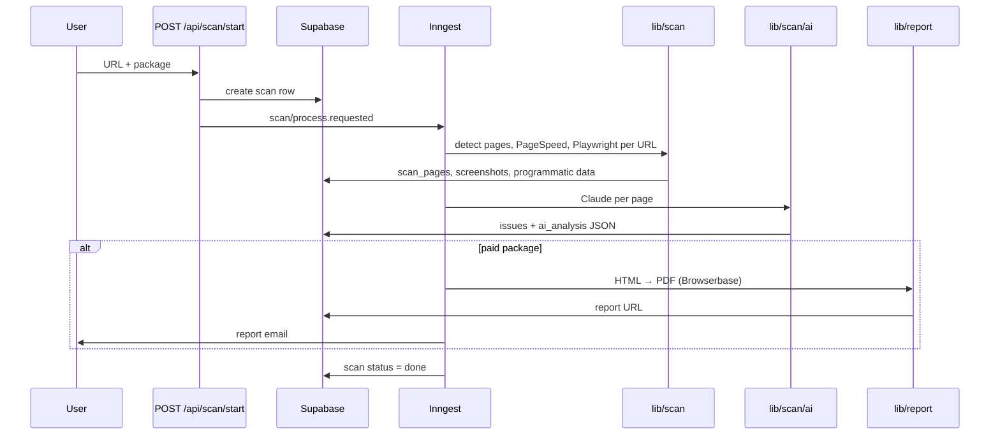

# QAlaunch Web — Architecture

High-level data flow for the scan pipeline. See also `docs/architecture-review.md` for product context.

## End-to-end flow

## Directory map (`web/`)

| Path | Role |
|------|------|
| `app/api/scan/start` | Validate URL, enqueue Inngest job |
| `lib/inngest/functions/run-scan.ts` | Orchestrates Inngest steps |
| `lib/scan/steps/` | Thin step handlers (DB, env checks, errors) |
| `lib/scan/runner.ts` | Playwright run + persist per page |
| `lib/scan/services/` | Browserbase session, axe, SEO, links, screenshots |
| `lib/scan/ai/` | Claude analysis + issue schemas |
| `lib/utils/` | URL normalize, site detection, page selection, PageSpeed helper |
| `lib/report/` | PDF generation and email payload |
| `lib/api/` | PageSpeed PSI, Paddle, queue helpers |
| `types/zod.ts` | Shared API/scan package schemas |

## Inngest pipeline (`run-scan`)

Steps run in `lib/inngest/functions/run-scan.ts`:

1. **mark-crawling** — scan status → crawling
2. **detect-and-select-pages** — homepage HTML → website type + page list (`lib/utils/detect`, `page-selection`)
3. **persist-metadata** — detection + selected pages on `scans`
4. **prepare-scanner** — env + scanner row prep
5. **collect-pagespeed** — PSI scores per URL → `scan_pages.page_speed_data`
6. **scan-browser:{url}** — Playwright + artifact upload to storage (`lib/artifacts`)
7. **scan-persist:{url}** — DB index only (`artifact_path`, screenshots; no browser rerun)
8. **finalize-scanner** — aggregate scanner status; exit early if failed
9. **reload-scan** — fresh scan row for AI inputs
10. **clear-ai-issues** — reset prior AI issues
11. **ai-page:{url}** — parallel Claude analysis per page
12. **persist-ai-issues** — merge into `issues` table
13. **generate-pdf** + **send-email** — paid packages only
14. **mark-done** — final status

Free scans skip PDF and email.

## External services

- **Supabase** — Postgres, storage (screenshots, reports)
- **Browserbase** — headless Chromium for Playwright and PDF render
- **Anthropic** — Claude for visual + heuristic issues
- **Google PageSpeed Insights** — Lighthouse scores
- **Inngest** — durable step execution on Vercel
- **Paddle** — checkout (separate from scan pipeline)

## Import conventions

- `@/lib/utils` — `cn()` and shared scan prep helpers
- `@/lib/scan` — runner, PDF, Playwright entrypoints, scan types
- `@/lib/scan/ai` — AI analysis functions and issue types
- `@/types/zod` — cross-cutting Zod schemas (packages, API bodies)
